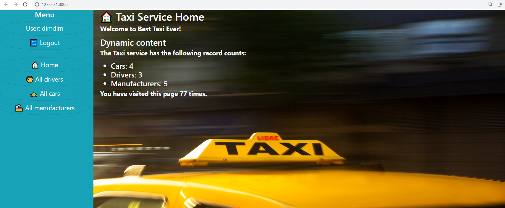

## test-taxi-service-deploy-heroku
[Go to demo page](https://test-taxi-service.herokuapp.com/)

```Data to demo access
 login: user
 password: user12345
```
login: user
password: user12345
## Additional information or tagline

Test deploy process project to heroku

## Installing / Getting started
A quick introduction of the minimal setup you need to get a hello world up & running.

python3 must already installed

```shell
git clone https://github.com/dmitriyKostiuk/test-taxi-service-deploy-heroku
cd test-taxi-service-deploy-heroku
python -m venv venv
source venv/bin/avtivate
pip install -r requirments.txt
python manage.py runserver
```

## Some information
It's my first project. So, nothing interesting

## Demo

